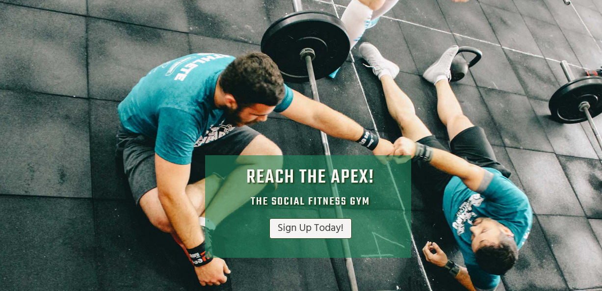
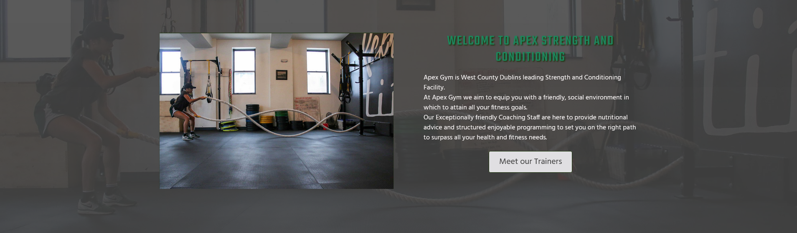

# Apex Gym
(Developer: Barry Ferguson)

[Live Webpage] (https://fergie-b.github.io/CI_PP1_AG/)

## Table of Contents

1. [Project Goals](#project-goals)
    1. [User Goals](#user-goals)
    2. [Site Owner Goals](#site-owner-goals)
2. [User Experience](#user-experience)
    1. [Target Audience](#target-audience)
    2. [User Requirements and Expectations](#user-requirements-and-expectations)
    3. [User Stories](#user-stories)
3. [Design](#design)
    1. [Design Choices](#design-choices)
    2. [Colour](#colours)
    3. [Fonts](#fonts)
    4. [Logo](#logo)
    5. [Structure](#structure)
    6. [Wireframes](#wireframes)
4. [Technologies Used](#technologies-used)
    1. [Languages](#languages)
    2. [Frameworks & Tools](#frameworks-&-tools)
5. [Features](#features)
6. [Testing](#validation)
    1. [HTML Validation](#HTML-validation)
    2. [CSS Validation](#CSS-validation)
    3. [Accessibility](#accessibility)
    4. [Performance](#performance)
    5. [Device and Browser testing](#device-and-browser-testing)
    6. [Testing user stories](#testing-user-stories)
8. [Bugs](#Bugs)
9. [Deployment](#deployment)
10. [Credits](#credits)
11. [Acknowledgements](#acknowledgements)

## Project Goals

### User Goals
- The ability to register as a member quickly and easily
- To see the Trainers are qualified and that the user is in safe hands
- Seeking information about the classes
- Find out the directions to the gym

### Site Owner Goals
- Promoting the message that the gym is friendly and community orientated
- Promotion and growth of their brand
- To fill the classes to ensure good cashflow to run the business well
- To highlight the most important information to prospective members

## User Experience

### Target Audience
- Performance Athletes
- People looking to lose weight/improve fitness health
- Social Gym goers
- Fitness Trainers/Students

### User Requirements and Expectations
- A Navigation system that lets the user find they are looking for within two clicks
- Strong presentation that conveys the brand ethos
- A site that is viewable across all devices
- Presentation of multiple ways to contact the business
- Content and features that let the user find the information they need
- Accesibility for all users needs

### User Stories

### First-Time User
#### User: Gillian Kearney, Nurse, Age 32
1.	As a first-time user of the website, I want to be able to view the class schedule
2.	As a first-time user of the website, I want to be able to find information on the membership types so that I get the most out of the training
3.	As a first-time user of the website, I want to be able to contact the gym for further information on the membership types
4.	As a first-time user of the website, I want to find out where the gym is on a map
5.	As a first-time user of the website, I want to know if the trainers have the proper qualifications
6.	As a first-time user of the website, I want to be able to view the business on Social Media platforms to get a feel for the gym

### Returning User
#### User: Tony McGuiness, Builder, Age 27
7.	As a returning user of the website, I want to be able to register as a member quickly and easily.
8.	As a returning user of the website, I want to be able to view the class schedule so that I can plan which classes I expect to attend.
9.	As a returning user of the website, I want to be able to view the class schedule to see if it aligns with my work hours.
10.	As a returning user of the website, I want to be able to contact the staff through various channels i.e. contact form or social

### Site Owner
#### User: Liam Kavanagh, Trainer and Manager at Apex Gym, Age 31
11.	As the site owner of the website, I want to be able to view the class schedule on my mobile easily to plan my working time better.
12.	As the site owner of the website, I want the members to feel comfortable training with our team by being able to access the information they need quickly
13.	As a site owner of the website, I want to be able to view the different types of membership succinctly and clearly to ensure I am offering my clients the right level of training.
14.	As the site owner I want the user to be still able to find what they want if they make a mistake on the site

## Design

### Design Choices
The websites pages where designed to contrast between the different sections allowing the end user to find what they are looking for easily and intuitively. It uses a bold Green colour scheme to reflect the idea of the outdoors ideology of the brand name Apex Gym.

### Colours
The color scheme was chosen on [Coolors.co](https://coolors.co/1a3409-444444-e0dfe2-1e855c-f6f3f3) to reflect the Gyms bright green branding theme. The #444444 Body Text was tested for legibility on the [WebAIM Contrast Checker](https://webaim.org/resources/contrastchecker/) to make sure the contrast of the colours chosen for the text worked against the Bright Green Theme.

Apex Gym Colour Scheme

### Fonts

[Teko](https://fonts.google.com/specimen/Teko/tester?query=tek) from the [Indian Type Foundry](https://fonts.google.com/?query=Indian%20Type%20Foundry) a display font on Google Fonts was chosen for the Site Headings.

Teko

For the Body text [Hind](https://fonts.google.com/specimen/Hind?query=hind) which is also from the [Indian Type Foundry](https://fonts.google.com/?query=Indian%20Type%20Foundry) was utilised. Hind is a solid choice for UI design, and a wise selection for electronic display embedding.

Hind

### Logo
The Two-colour website logo was designed in Adobe Illustrator using the Teko Font and was outputed as an SVG to keep the image lightweight to speed up loading times.

Logo

### Structure
The Website structure is laid out so every section is easy to navigate to. On Desktop mode the user should be able to view more information about the Gym above the fold on every page.
#### Site Pages:
- A Homepage with sections Welcoming the User and outling the available training plans
- An About Page with sections reiterating what the gym offers, a section introducing the Trainers and their quailficationss by use of an image overlay and a video giving a tour of the facility
- A Classes page which provides a schedule of the available training times
- A Sign up page where the user can register for a membership through an online form
- A Contact Page which provides a Contact Form, the address of the Gym and a Google Location map
- A Privacy Policy page with a basic structure
- A 404 page with a Graphic and Button to bring the user to the Homepage

### Wireframes

Home

About

Menu

Gallery

Contact

Privacy Policy

404

## Technologies Used

### Languages
- HTML5
- CSS3

### Frameworks & Tools
- [Bootstrap v5.0](https://getbootstrap.com/docs/5.2/getting-started/introduction/)
- [Git](https://git-scm.com/)
- [Github](https://github.com/)
- [Gitpod](https://gitpod.io/workspaces)
- Adobe Photoshop
- Adobe Illustrator
- [Balsamiq](https://balsamiq.com/)
- [Coolors.co](https://coolors.co/)
- [Google Fonts](https://fonts.google.com/)
- [Favicon.io](https://favicon.io/)
- [Font Awesome](https://fontawesome.com/)
- [CSS Text-Shadow Generator](https://html-css-js.com/css/generator/text-shadow/)
- [CSS Box-Shadow Generator](https://html-css-js.com/css/generator/box-shadow/)

## Features
The Main features of the Apex Gym website span across Seven pages and include 12 sections

### Header Section
- Appears on all pages sitewide
- Encloses the Sites Responsive Logo and Bootstrap Navigation Bar
- The Bootstrap Navigation Bar is fully responsive, changes to Navbar-Toggle on small screens
- The Links included are Home, About Us, Classes, Sign Up and Contact Us
- The navbar has an active class in the HTML to highlight what page the user is browsing
- User Stories covered: 12

### Hero-Image
- Contains an animated image that introduces the user to the gyms policy of social training
- Has a fade in animated message box with a button link to the sign up forms
- User Stories covered: 7

### Welcome Section
- Outlines the Gyms core message with a small paragraph of text
- Contains an image and background image showing the Gym in action
- Has a Link Button to meet the Training Team
- User Stories covered: 5

### Training Plan Section
- Contains three columns with list information detailing the Gyms Training plans
- Each Column has an SVG image in the background similar to the site logo
- User Stories covered: 2, 13

### About Section
- Details a short description of the Gym and the equipment offered for use by trainees
- Shows an image of the gym

### Training Team Section
- Three column layout showing an image of the Gyms Trainers
- Each image has an overlay which is activated when the user mouses over
- The overlay details the trainers individual qualifications and experience
- User Stories covered: 5

### Video Section
- Provides the user with a video tour of the gym facilities

### Schedule Section
- A Responsive Bootstrap form which details the Gym Training times and what is on
- The form scrolls horizontally at small screen sizes to allow the viewer full view of information
- User Stories Covered: 1, 8, 9, 11

### Sign Up Section
- A Bootstrap Sign up form is included that offer the user the choice to tick which membership offer they prefer
- User stories covered: 7

### Contact Section
- A Bootstrap Contact form which alows the user to contact the Gym
- A Google map is provided allowing the user to located the Gym by address
- User stories covered: 3, 4, 10

### Privacy Section
- Information on the way the customers data is handled
- User stories covered:

### 404 Section
- A section containing an image of an erro message and a Home button to direct the user
- User stories covered: 12, 14

### Footer
- Includes a column containing links to the Gyms three Social Media accounts
- Footer links containing Site Copyright and the Privacy Policy links
- User Stories covered: 3, 6, 10, 12

## Validation

### HTML Validation
The [W3C Markup Validation Service](https://validator.w3.org/) was used to check the HTML and all code is clear of errors.

Homepage

About page

Classes page

Sign Up page

Contact Us page

Privacy Policy page

404 page

### CSS Validation
The [W3C CSS Validation Service](https://jigsaw.w3.org/css-validator/validator) was used to validate the sites css.
No errors are found in the site CSS and the site validates as [CSS Level 3 + SVG](https://www.w3.org/Style/CSS/current-work.html)
There are Ten warnings due to external stylesheets from the Bootstrap Integration and from some Vendor Extensions such as -webkit-box-shadow

Style CSS Success Result

Full Page Breakdown

### Accessibility
The site pages where checked using the [Web AIM Wave Web Accessibility Evaluation Tool](https://wave.webaim.org/) and some errors with contrast on the links and forms where checked and the code was edited to fix them.

Homepage

About page

Classes page

Sign Up page

Contact Us page

Privacy Policy page

404 page

### Performance Testing
The website was tested in Google Lighthouse to see how it performs.

Homepage

About page

Classes page

Sign Up page

Contact Us page

Privacy Policy page

404 page

### Device and Browser Testing
Apex Gym Website was tested on the devices and browsers listed:
- Microsoft Surface Pro - Firefox
- IPad Mini - Safari, Google Chrome
- Samsung Galaxy A53 - Google Chrome
- Windows Desktop - Firefox, Chrome, Edge

### Testing User Stories

1. As a first-time user of the website, I want to be able to view the class schedule

| **Feature** | **Action** | **Expected Result** | **Actual Result** |
|-------------|------------|---------------------|-------------------|
| Class Schedule | Navigate to the Classes page | Find the Schedule of Class Times | Works as expected |

Screenshots

2. As a first-time user of the website, I want to be able to find information on the membership types so that I get the most out of the training

| **Feature** | **Action** | **Expected Result** | **Actual Result** |
|-------------|------------|---------------------|-------------------|
| Training Plan Columns | On the Home page, scroll down to the Training Plan Section | View the Training Plans | Works as expected |
| Training Plan Columns | On any page, scroll down to the Training Plan Section  | View the Training Plans | Works as expected |

Screenshots

3. As a first-time user of the website, I want to be able to contact the gym for further information on the membership types

| **Feature** | **Action** | **Expected Result** | **Actual Result** |
|-------------|------------|---------------------|-------------------|
| Contact Form | On any page, click the link in the top navbar | View the Contact form | Works as expected |
| Social Media Links | On any page, scroll down to the Footer  | View the Social Media Links | Works as expected |

Screenshots

4. As a first-time user of the website, I want to find out where the gym is on a map

| **Feature** | **Action** | **Expected Result** | **Actual Result** |
|-------------|------------|---------------------|-------------------|
| Map | On any page, click the link in the top navbar | View the Map on the Contact page | Works as expected |

Screenshots

5. As a first-time user of the website, I want to know if the trainers have the proper qualifications

| **Feature** | **Action** | **Expected Result** | **Actual Result** |
|-------------|------------|---------------------|-------------------|
| Training Team | On About Page scroll to Team Section | Hover over image to see the qualifications | Works as expected |
| Training Team | On Home page Welcome section click link to go to About page  | Hover over image to see the qualifications | Works as expected |

Screenshots

6. As a first-time user of the website, I want to be able to view the business on Social Media platforms to get a feel for the gym

| **Feature** | **Action** | **Expected Result** | **Actual Result** |
|-------------|------------|---------------------|-------------------|
| Social Media Links | On any page scroll to the footer | View the Social media links | Works as expected |

Screenshots

7. As a returning user of the website, I want to be able to register as a member quickly and easily

| **Feature** | **Action** | **Expected Result** | **Actual Result** |
|-------------|------------|---------------------|-------------------|
| Sign Up Form | On the Home page click "sign up now" cta in the Hero Section | Sign up page opens | Works as expected |
| Sign Up Form | On any page click the Sign Up link in the top navbar  | View the Sign up form | Works as expected |

Screenshots

8. As a returning user of the website, I want to be able to view the class schedule so that I can plan which classes I expect to attend

| **Feature** | **Action** | **Expected Result** | **Actual Result** |
|-------------|------------|---------------------|-------------------|
| Classes Schedule | On any page click the Classes link in the top navbar | View the Class Schedule | Works as expected |

Screenshots

9. As a returning user of the website, I want to be able to view the class schedule to see if it aligns with my work hours

| **Feature** | **Action** | **Expected Result** | **Actual Result** |
|-------------|------------|---------------------|-------------------|
| Classes Schedule | On any page click the Classes link in the top navbar | View the Class Schedule | Works as expected |

Screenshots

10. As a returning user of the website, I want to be able to contact the staff through various channels i.e. contact form or social

| **Feature** | **Action** | **Expected Result** | **Actual Result** |
|-------------|------------|---------------------|-------------------|
| Contact Form | On any page, click the link in the top navbar | View the Contact form | Works as expected |
| Social Media Links | On any page, scroll down to the Footer  | View the Social Media Links | Works as expected |

Screenshots

11. As the site owner of the website, I want to be able to view the class schedule on my mobile easily to plan my working time better

| **Feature** | **Action** | **Expected Result** | **Actual Result** |
|-------------|------------|---------------------|-------------------|
| Classes Schedule | On any page on mobile click the Classes link in the collapsed navbar | View the Class Schedule | Works as expected |

Screenshots

12. As the site owner of the website, I want the members to feel comfortable training with our team by being able to access the information they need quickly

| **Feature** | **Action** | **Expected Result** | **Actual Result** |
|-------------|------------|---------------------|-------------------|
| Navbar | On any page, click the links in the top navbar | View the Information required | Works as expected |
| Footer | On any page, scroll down to the Footer  | View the Information required | Works as expected |
| 404 Image | On error 404 click the Home Button | Brought back to the Home page | Works as expected |

Screenshots

13. As a site owner of the website, I want to be able to view the different types of membership succinctly and clearly to ensure I am offering my clients the right level of training

| **Feature** | **Action** | **Expected Result** | **Actual Result** |
|-------------|------------|---------------------|-------------------|
| Training Plan Columns | On the Home page, scroll down to the Training Plan Section | View the Training Plans | Works as expected |
| Training Plan Columns | On any page, scroll down to the Training Plan Section  | View the Training Plans | Works as expected |

Screenshots

14. As the site owner I want the user to be still able to find what they want if they make a mistake on the site

| **Feature** | **Action** | **Expected Result** | **Actual Result** |
|-------------|------------|---------------------|-------------------|
| 404 Image | On error 404 click the Home Button | Brought back to the Home page | Works as expected |

Screenshots

## Bugs

| **Bug** | **Fix** |
| ----------- | ----------- |
| Classes schedule overlapping right edge on mobile | Added Bootstrap class Table Responsive in HTML |
| Accessibiltiy Issues in Navbar | Changed active class to Bold Text |
| Accessibility Issues in Footer | Changed Footer background colour and Text styling to comply |
| Hero Section Button appears too big on mobile | Fixed this with a media query to change the positioning and sizing |

## Deployment

I deployed the website on Github pages as per the following instructions:
1. In your Github Repository click on the Settings link in the tob sub navbar
2. In the left sidebar click on the Pages link
3. Select your branch as 'Main' and 'Root'
4. The Webpage will generate and you will receive a message stating "Your site is published at https://fergie-b.github.io/CI_PP1_AG/"

## Credits

### Media
In order of Appearance:
Images used on the site are not the property of the developer unless stated*
- [Apex Gym Logo](assets/images/logo.svg): Designed in Adobe Illustrator by Developer
- [Hero-Image](assets/images/hero-image.jpg) Photo by <a href="https://unsplash.com/@victorfreitas?utm_source=unsplash&utm_medium=referral&utm_content=creditCopyText">Victor Freitas</a> on <a href="https://unsplash.com/s/photos/group-training?utm_source=unsplash&utm_medium=referral&utm_content=creditCopyText">Unsplash</a>
- [Intro-Image](assets/images/intro-image.jpg) Photo by <a href="https://unsplash.com/@element5digital?utm_source=unsplash&utm_medium=referral&utm_content=creditCopyText">Element5 Digital</a> on <a href="https://unsplash.com/s/photos/group-gym?utm_source=unsplash&utm_medium=referral&utm_content=creditCopyText">Unsplash</a>
- [About-Image](assets/images/about-image.jpg) Photo by [Victor Freitas](https://www.pexels.com/photo/10-lb-rogue-weight-plate-near-people-gathered-703016/)
- [Trainer-1](assets/images/trainer-1.jpg) Photo by <a href="https://unsplash.com/@lgnwvr?utm_source=unsplash&utm_medium=referral&utm_content=creditCopyText">LOGAN WEAVER | @LGNWVR</a> on <a href="https://unsplash.com/?utm_source=unsplash&utm_medium=referral&utm_content=creditCopyText">Unsplash</a>
- [Trainer-2](assets/images/trainer-2.jpg) Photo by <a href="https://unsplash.com/@samuelgirven?utm_source=unsplash&utm_medium=referral&utm_content=creditCopyText">Samuel Girven</a> on <a href="https://unsplash.com/s/photos/personal-trainer?utm_source=unsplash&utm_medium=referral&utm_content=creditCopyText">Unsplash</a>
- [Trainer-3](assets/images/trainer-3.jpg) Photo by <a href="https://unsplash.com/@lollish?utm_source=unsplash&utm_medium=referral&utm_content=creditCopyText">Lorenzo Fattò Offidani</a> on <a href="https://unsplash.com/s/photos/athlete?utm_source=unsplash&utm_medium=referral&utm_content=creditCopyText">Unsplash</a>
- The Website video was sourced from [Youtube](https://www.youtube.com/watch?v=3wY3PlnVzGs)
- The Column Background SVGs [Gold](assets/images/gold.svg), [Silver](assets/images/silver.svg), and [Bronze](assets/images/bronze.svg) were generated in Adobe Illustrator by the Developer
- The [404 Image](assets/images/404.svg) was generated in Adobe Illustrator by the Developer

### Code
- The Bootstrap Navbar code snippet "Navbar without List items" was ttaken from the Bootstrap site at:
https://getbootstrap.com/docs/5.0/components/navbar/#
- The Cover text fade in animation was based on this [Tutorial](https://www.tutorialspoint.com/css/css_animation_fade_in_left.html)
- The Sign Up and Contact Forms components were built from code found on the [Bootstrap Site](https://getbootstrap.com/docs/5.0/forms/overview/#overview)
- The 404 Page was built using instructions from [Github](https://docs.github.com/en/pages/getting-started-with-github-pages/creating-a-custom-404-page-for-your-github-pages-site)

## Acknowledgements
I would like to thank my Mentor, Mo Shami for his advice on where to take this project.

  

