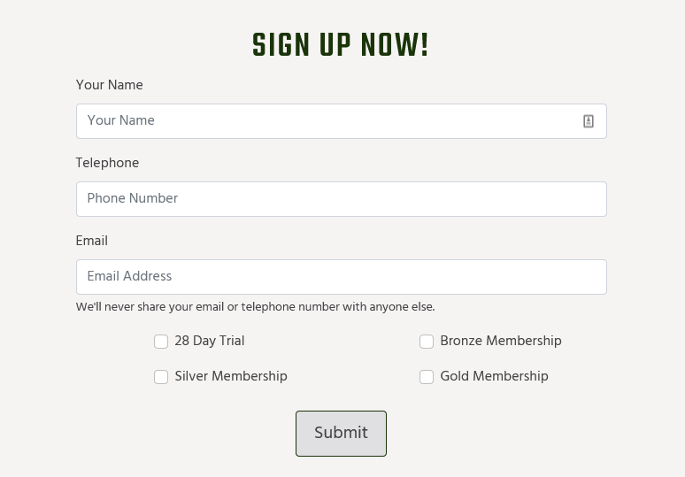

# Apex Gym
(Developer: Barry Ferguson)

[Live Webpage] (https://fergie-b.github.io/CI_PP1_AG/)

## Table of Contents

1. [Project Goals](#project-goals)
    1. [User Goals](#user-goals)
    2. [Site Owner Goals](#site-owner-goals)
2. [User Experience](#user-experience)
    1. [Target Audience](#target-audience)
    2. [User Stories](#user-stories)
3. [Design](#design)
    1. [Design Choices](#design-choices)
    2. [Colour](#colours)
    3. [Fonts](#fonts)
    4. [Logo](#logo)
    5. [Structure](#structure)
    6. [Wireframes](#wireframes)
4. [Technologies Used](#technologies-used)
    1. [Languages](#languages)
    2. [Frameworks & Tools](#frameworks-&-tools)
5. [Features](#features)
6. [Testing](#validation)
    1. [HTML Validation](#HTML-validation)
    2. [CSS Validation](#CSS-validation)
    3. [Accessibility](#accessibility)
    4. [Performance](#performance)
    5. [Device testing](#performing-tests-on-various-devices)
    6. [Browser compatibility](#browser-compatability)
    7. [Testing user stories](#testing-user-stories)
8. [Bugs](#Bugs)
9. [Deployment](#deployment)
10. [Credits](#credits)
11. [Acknowledgements](#acknowledgements)

## Project Goals

### User Goals
- The ability to register as a member quickly and easily
- To see the Trainers are qualified and that the user is in safe hands
- Seeking information about the classes
- Find out the directions to the gym

### Site Owner Goals
- Promoting the message that the gym is friendly and community orientated
- Promotion and growth of their brand
- To fill the classes to ensure good cashflow to run the business well
- To highlight the most important information to prospective members

## User Experience

### Target Audience
- Performance Athletes
- People looking to lose weight/improve fitness health
- Social Gym goers
- Fitness Trainers/Students

### User Stories

### First-Time User
#### User: Gillian Kearney, Nurse, Age 32
1.	As a first-time user of the website, I want to be able to view the class schedule
2.	As a first-time user of the website, I want to be able to find information on the membership types so that I get the most out of the training
3.	As a first-time user of the website, I want to be able to contact the gym for further information on the membership types
4.	As a first-time user of the website, I want to find out where the gym is on a map
5.	As a first-time user of the website, I want to know if the trainers have the proper qualifications
6.	As a first-time user of the website, I want to be able to view the business on Social Media platforms to get a feel for the gym

### Returning User
#### User: Tony McGuiness, Builder, Age 27
1.	As a returning user of the website, I want to be able to register as a member quickly and easily.
2.	As a returning user of the website, I want to be able to view the class schedule so that I can plan which classes I expect to attend.
3.	As a returning user of the website, I want to be able to view the class schedule to see if it aligns with my work hours.
4.	As a returning user of the website, I want to be able to contact the staff through various channels i.e. contact form, telephone, social

### Site Owner
#### User: Liam Kavanagh, Trainer and Manager at Apex Gym, Age 31
1.	As the site owner of the website, I want to be able to view the class schedule on my mobile easily to plan my working time better.
2.	As the site owner of the website, I want the members to feel comfortable training with our team by being able to access the information they need quickly
3.	As a site owner of the website, I want to be able to view the different types of membership succinctly and clearly to ensure I am offering my clients the right level of training.

## Design

### Design Choices
The websites pages where designed to contrast between the different sections allowing the end user to find what they are looking for easily and intuitively. It uses a bold Green colour scheme to reflect the idea of the outdoors ideology of the brand name Apex Gym.

### Colours
The color scheme was chosen on [Coolors.co](https://coolors.co/1a3409-444444-e0dfe2-1e855c-f6f3f3) to reflect the Gyms bright green branding theme. The #444444 Body Text was tested for legibility on the [WebAIM Contrast Checker](https://webaim.org/resources/contrastchecker/) to make sure the contrast of the colours chosen for the text worked against the Bright Green Theme.

Apex Gym Colour Scheme

### Fonts

[Teko](https://fonts.google.com/specimen/Teko/tester?query=tek) from the [Indian Type Foundry](https://fonts.google.com/?query=Indian%20Type%20Foundry) a display font on Google Fonts was chosen for the Site Headings.

Teko

For the Body text [Hind](https://fonts.google.com/specimen/Hind?query=hind) which is also from the [Indian Type Foundry](https://fonts.google.com/?query=Indian%20Type%20Foundry) was utilised. Hind is a solid choice for UI design, and a wise selection for electronic display embedding.

Hind

### Logo
The Two-colour website logo was designed in Adobe Illustrator using the Teko Font and was outputed as an SVG to keep the image lightweight to speed up loading times.

Logo

### Structure
The Website structure is laid out so every section is easy to navigate to. On Desktop mode the user should be able to view more information about the Gym above the fold on every page.
#### Site Pages:
- A Homepage with sections Welcoming the User and outling the available training plans
- An About Page with sections reiterating what the gym offers, a section introducing the Trainers and their quailficationss by use of an image overlay and a video giving a tour of the facility
- A Classes page which provides a schedule of the available training times
- A Sign up page where the user can register for a membership through an online form
- A Contact Page which provides a Contact Form, the address of the Gym and a Google Location map

### Wireframes

Home

About

Menu

Gallery

Contact

## Technologies Used

### Languages
- HTML5
- CSS3

### Frameworks & Tools
- [Bootstrap v5.0](https://getbootstrap.com/docs/5.2/getting-started/introduction/)
- [Git](https://git-scm.com/)
- [Github](https://github.com/)
- [Gitpod](https://gitpod.io/workspaces)
- Adobe Photoshop
- Adobe Illustrator
- [Balsamiq](https://balsamiq.com/)
- [Coolors.co](https://coolors.co/)
- [Google Fonts](https://fonts.google.com/)
- [Favicon.io](https://favicon.io/)
- [Font Awesome](https://fontawesome.com/)
- [CSS Text-Shadow Generator](https://html-css-js.com/css/generator/text-shadow/)
- [CSS Box-Shadow Generator](https://html-css-js.com/css/generator/box-shadow/)

## Features
The Main features of the Apex Gym website span across five pages and include 11 sections

### Header Section
- Appears on all pages sitewide
- Encloses the Sites Responsive Logo and Bootstrap Navigation Bar
- The Bootstrap Navigation Bar is fully responsive, changes to Navbar-Toggle on small screens
- The Links included are Home, About Us, Classes, Sign Up and Contact Us
- The navbar has an active class in the HTML to highlight what page the user is browsing

### Hero-Image
- Contains an animated image that introduces the user to the gyms policy of social training
- Has a fade in animated message box with a button link to the sign up forms

### Welcome Section
- Outlines the Gyms core message with a small paragraph of text
- Contains an image and background image showing the Gym in action
- Has a Link Button to meet the Training Team

### Training Plan Section
- Contains three columns with list information detailing the Gyms Training plans
- Each Column has an SVG image in the background similar to the site logo

### About Section
- Details a short description of the Gym and the equipment offered for use by trainees
- Shows an image of the gym

### Training Team Section
- Three column layout showing an image of the Gyms Trainers
- Each image has an overlay which is activated when the user mouses over
- The overlay details the trainers individual qualifications and experience

### Video Section
- Provides the user with a video tour of the gym facilities

### Schedule Section
- A Responsive Bootstrap form which details the Gym Training times and what is on
- The form scrolls horizontally at small screen sizes to allow the viewer full view of information

### Sign Up Section
- A Bootstrap Sign up form is included that offer the user to tick which membership offer the prefer

### Contact Section
- A Bootstrap Contact form which alows the user to contact the Gym
- A Google map is provided allowing the user to located the Gym by address

### Footer
- Includes a column containing links to the Gyms three Social Media accounts
- Footer links contatining Site Copyright and the Privacy Policy links

